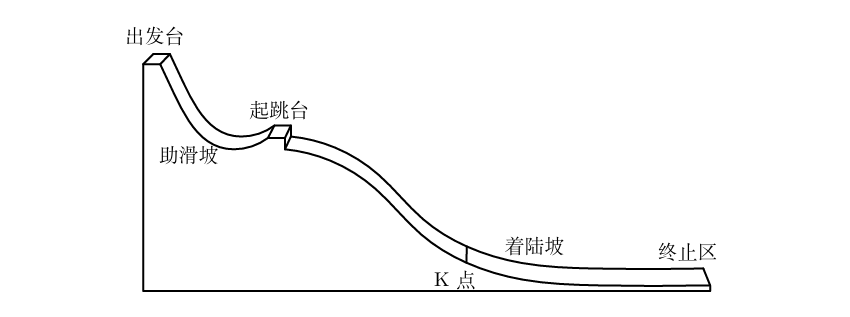

# 第二十七届华东杯大学生数学建模邀请赛试题

## A 题 跳台滑雪问题

跳台滑雪起源于19世纪，是冬季运动会的传统竞技项目。今年亚洲冬季运动会在我国哈尔滨举行，跳台滑雪项目吸引了包括中国在内的亚洲各国运动健儿踊跃参加，我国运动员取得了优异的成绩。

跳台滑雪融合了速度、力量与精确控制，展现出运动员在高空飞跃中的技巧与勇气，是冬季运动中最具观赏性的项目之一。运动员在完成过程中，不同的身体姿态对最终得分有很大影响，分析各阶段运动员应采取怎样的姿态能够提高运动成绩。

跳台滑雪的比赛场地通常由出发台、助滑坡、起跳台、着陆坡和终止区组成，如下图所示。跳台滑雪的技术可分解为助滑与起跳、空中飞行、着陆和终止滑行4个阶段。

跳台滑雪的评分标准由距离分和姿势分组成，并结合赛道参数计算总分（附录A）。

请建立数学模型，解决以下问题，并根据附录B提供的赛道数据给出计算结果。

### A 问题 1

运动员在助滑坡应采取何种姿势，以获得较大的起跳速度？

### A 问题 2

起跳后，运动员应如何控制身体及滑雪板，以便顺利进入着陆区，并获得较好的飞行效果？

### A 问题 3

着陆时，运动员应采取何种策略，以保持身体平衡？

### 附录 A 跳台滑雪的评分标准

跳台滑雪的评分标准由距离分和姿势分组成，并结合赛道参数计算总分。

1. **距离分**：每条赛道设有一个K点，通常为赛道长度的60%–70%。跳跃达到K点得120分；超过或不足K点，每米±1.8分。
2. **姿势分**：由5名裁判根据运动员的飞行姿态、着陆情况等打分，每人满分为20分。去掉最高分和最低分，然后取平均值。
3. **总分 = 距离分 + 姿势分 + 风速赛道补偿分**

### 附录 B 赛道参数

不同级别的赛事，赛道参数不相同。为明确起见，本题采用北京冬奥会跳台滑雪项目的参数值：

- 从起跳到着陆坡最低点的水平距离为140米。
- K点为120米。
- 赛道落差约60米。
- 起跳台的仰角为10°–12°。
- 着陆坡的倾角为32°–36°。
- 终止区为平坦区域。
- 滑雪板长度不超过身高的145%；服装必须紧身。
- 着陆摔倒，则扣姿势分；提前脱落滑雪板，则成绩无效。

---

## B 题 工序安排问题

一个成衣制造厂有三条相同的服装生产流水线用于生产某种服装，目前每件服装利润40元。每一条流水线都依次包含以下五道工序：裁剪、缝制、水洗、熨烫、包装。在无故障或者意外的情况下，每条流水线的每道工序分别需要8人、10人、5人、4人、3人。裁剪、缝制、水洗、熨烫、包装工序发生故障时产生的材料损失费分别为50元、50元、30元、30元、10元，每次排除故障所花时间分别为4分钟、3分钟、6分钟、1分钟、1分钟。目前该成衣制造厂有100名工人，他们的技能分布如下表。

| 熟练程度 | 可从事工序 | 各工序工作效率（件/天） | 故障率（次/小时） | 现有人员 | 提升1级熟练程度的培训总费用及时间 |
|----------|------------|--------------------------|-------------------|----------|-----------------------------------|
| 技工1级  | 包装       | 30                       | 0.5               | 7        | 100元、半天                       |
| 技工2级  | 熨烫/包装   | 14/30                    | 0.5               | 10       | 150元、1天                        |
| 技工3级  | 水洗/熨烫/包装 | 12/14/35                | 0.4               | 15       | 100元、1天                        |
| 技工4级  | 裁剪/水洗/熨烫/包装 | 9/13/16/40             | 0.2               | 33       | 300元、3天                        |
| 技工5级  | 裁剪/缝制/水洗/熨烫/包装 | 10/9/14/16/40         | 0.2               | 35       | -                                 |

假设工人经过培训后可以立即达到提升熟练程度的效果，马上可以上岗工作。此外，假设在每道工序故障时都可能影响下一道工序的生产。请建立数学模型，确定工人的分配方案（分配到哪道工序）和培训策略（提升哪些工人的技能等级），使得在满足每道工序产能需求的前提下总利润达到最大。

### B 问题 1

测算在最优安排下不同工序的故障损失。

### B 问题 2

测算该厂4周（按每周5天，每天8小时计）的总利润，并分析它对哪一道工序最为敏感。

### B 问题 3

如果所有工序的工人在工作4周后都需要更换工种以防疲劳，请安排24周的生产计划。

---

## C 题 商品期货涨跌幅预测问题

商品期货（如螺纹钢、铁矿石、焦炭、焦煤等）是金融市场中的重要交易品种，其价格波动受到多种因素的影响，包括供需关系、宏观经济政策、国际市场变化等。若能利用历史数据预测商品期货未来的涨跌幅，则可帮助投资者更好地进行交易决策。

现有数据集为1分钟级数据，包括时间戳、开盘价、最高价、最低价、收盘价、成交量、持仓量等。请基于该数据集建立数学模型，预测商品期货未来30分钟的涨跌幅。涨跌幅定义为

\[ \text{涨跌幅} = \frac{P_{t+30} - P_t}{P_t} \times 100\% \]

其中 \(P_t\) 是当前时刻的价格，\(P_{t+30}\) 是30分钟后的价格。要求从1分钟级数据中提取出可能影响30分钟涨跌幅的特征，选择合适的机器学习模型对未来30分钟的涨跌幅进行预测。解释模型的选择理由，并使用适当的评价指标评估模型的性能，讨论模型的局限性及可能的改进方向。

### 提交内容

1. 数据预处理和特征提取的详细步骤。
2. 模型选择的理由及模型的具体实现。
3. 模型训练和验证的过程及结果。
4. 模型的预测效果分析及改进建议。
5. 程序源码及文档。

### 附录 数据集

- **下载地址**：[https://pan.baidu.com/s/14kb1ZSvAIDMUxOrQw6GJoQ](https://pan.baidu.com/s/14kb1ZSvAIDMUxOrQw6GJoQ)（提取码：esb1）
- **数据说明**：data文件夹下包含了从2017年1月3日至2025年4月18日的商品期货1分钟级主力合约数据，包括不锈钢（SS）、硅铁（SF）、锰硅（SM）、螺纹钢（RB）、热轧卷板（HC）、铁矿石（I）、焦煤（JM）。此处的主力合约都是按持仓排序筛选出来的主力。如果某一天主力合约发生变化，那么前一天的主力合约和当天的主力合约数据都会出现在前一天数据里面。
